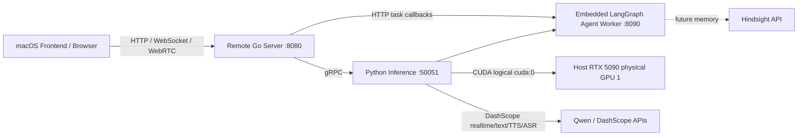

# CyberVerse 远程 GPU 部署说明

这个目录用于把数字人重模型部署到 Ubuntu 24.04 + RTX 5090 机器上。Mac 本地只运行前端或轻量开发服务，通过 HTTP/WebSocket/WebRTC 访问远程 API。

## 架构



## GPU 选择

`docker-compose.yml` 使用：

```yaml
gpus:
  - driver: nvidia
    device_ids: ["1"]
    capabilities: ["gpu"]
environment:
  - NVIDIA_VISIBLE_DEVICES=1
```

这会把宿主机物理 GPU 1 暴露给容器。容器内部通常会把这张卡重新编号成 `cuda:0`，所以 `cyberverse_config.gpu.yaml` 里写 `cuda_visible_devices: 0` 和 `device: "cuda:0"` 是正确的，不会占用宿主机物理 GPU 0。

## 首次启动

在远程机器上：

```bash
cd ~/project/CyberVerse
cp deploy/gpu/.env.example .env
```

编辑 `.env`，至少填：

```bash
DASHSCOPE_API_KEY=...
TURN_PASSWORD=...
```

下载 FlashHead 权重：

```bash
docker compose -f deploy/gpu/docker-compose.yml --profile weights run --rm weights
```

如果 Hugging Face 访问慢，可以先设置：

```bash
export HF_ENDPOINT=https://hf-mirror.com
```

启动服务：

```bash
docker compose -f deploy/gpu/docker-compose.yml up --build
```

前台运行时按 `Ctrl+C` 会停止 compose 管理的服务。需要后台运行时使用：

```bash
docker compose -f deploy/gpu/docker-compose.yml up -d --build
```

## Mac 访问远程服务

远程服务启动后，Mac 前端可指向：

```bash
VITE_API_BASE=http://122.205.95.186:8080/api/v1
VITE_WS_BASE=ws://122.205.95.186:8080
```

远程机器需要开放 TCP `8080` 和 `8443`。`50051` 和 `8090` 只在 docker compose 内部网络使用，不需要对公网开放。

连通性检查：

```bash
curl http://122.205.95.186:8080/api/v1/health
curl http://122.205.95.186:8080/api/v1/components
```

跨公网访问时，部分网络会拦截 HTTP `DELETE`。前端关闭会话默认使用兼容接口：

```bash
POST http://122.205.95.186:8080/api/v1/sessions/{session_id}/close
```

原有 `DELETE /api/v1/sessions/{session_id}` 仍保留，适合内网或未拦截 DELETE 的环境。

## 权重来源

当前默认使用 FlashHead Lite 单卡配置，权重目录为：

```text
checkpoints/SoulX-FlashHead-1_3B
checkpoints/wav2vec2-base-960h
```

来源：

- `Soul-AILab/SoulX-FlashHead-1_3B`
- `facebook/wav2vec2-base-960h`

如果要改成 Pro 模型，把 `deploy/gpu/cyberverse_config.gpu.yaml` 里的 `model_type: "lite"` 改成 `model_type: "pro"`。单张 5090 可以尝试 Pro，但实时性通常不如 Lite；FlashHead 官方说明 Pro 实时体验更偏向双 5090 + SageAttention。
