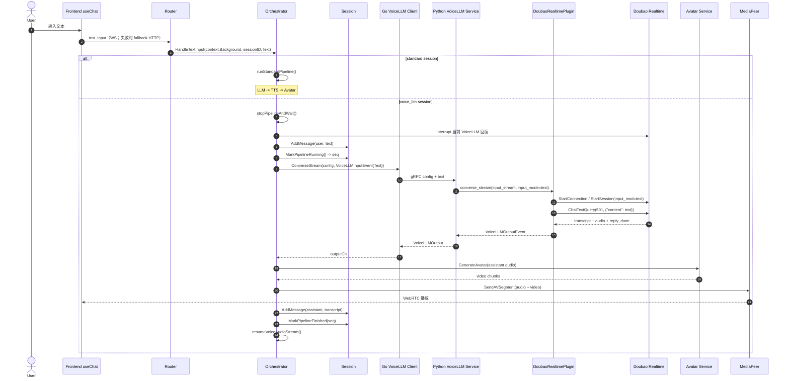
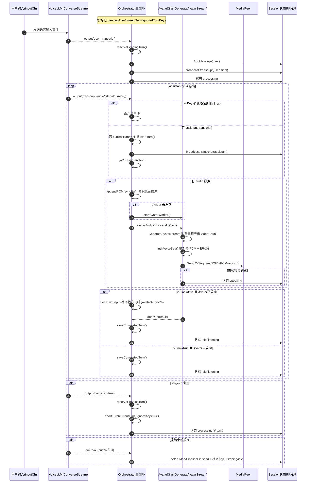

# VoiceLLM 文本输入改走 Doubao 的设计与实现

文档语言：中文

## 基本信息

- 日期：`2026-04-24`
- 状态：`当前工作区已实现主链路`
- 主题：`voice_llm 会话中的 text_input 重构`

## 背景与问题

在旧实现里，前端发出的 `text_input` 默认走标准文本链路：

- `LLM -> TTS -> Avatar`

这个设计对 `standard` 会话没有问题，但对 `voice_llm` 会话不一致：

- 语音输入走的是 Doubao VoiceLLM
- 文本输入却绕开 Doubao，走本地标准链路

结果是同一个会话内会出现两套推理路径：

- 一套是 Doubao 负责理解和说话
- 一套是本地 LLM/TTS 负责理解和说话

这会带来几个问题：

- 会话体验不一致，文本和语音像在和两个不同的 agent 对话
- `voice_llm` 场景下无法复用 Doubao 原生文本输入能力
- 文本输入时的中断、恢复、上下文延续不好统一

## 目标

- 在 `voice_llm` 会话中，文本输入直接交给 Doubao VoiceLLM 处理。
- 保持前端协议尽量不变，仍然复用 `text_input` 事件。
- 当用户在助手说话时发送文本，新的文本请求应打断当前回复并切到新的文本轮次。
- 文本轮次结束后，自动恢复麦克风语音会话。
- 标准会话 `standard` 的行为保持不变。

## 非目标

- 不改前端 `text_input` 的消息格式。
- 不把所有会话统一改成 Doubao；`standard` 继续走现有标准链路。
- 不在这次改动中重构 Avatar 链路。

## 核心设计决策

### 1. 前端协议保持不变

前端仍发送：

```json
{ "type": "text_input", "text": "..." }
```

这样可以避免额外协议演进，也能继续兼容当前 WebSocket 和 HTTP 入口。

### 2. 后端按 session mode 分流

- `ModeStandard`：继续走 `LLM -> TTS -> Avatar`
- `ModeVoiceLLM`：改走 `Doubao VoiceLLM -> Avatar`

这个分流点放在 orchestrator，而不是前端或 API handler，原因是它最了解当前 session 的运行模式和 pipeline 状态。

### 3. 统一 VoiceLLM 输入模型

为了解决“同一条 VoiceLLM 通道既要收音频，也要收文本”的问题，新增统一输入结构：

- `VoiceLLMInputEvent`
  - `Audio []byte`
  - `Text string`

这样 Go 编排层、gRPC client、Python 服务层和 Doubao 插件都可以复用同一套接口。

### 4. 文本输入采用“单轮文本 + 自动恢复音频”

当前架构是长连接语音 pipeline，不是一个原生的“同一条会话中随时混发 text/audio”的抽象。因此本次实现采用：

1. 打断当前 VoiceLLM 语音回复
2. 启动一次只发送一条文本输入的 VoiceLLM turn
3. 等文本轮次结束
4. 自动恢复麦克风音频流

这是当前代码结构下最小改动、最容易落地的方式。

### 5. 增加 pipeline 序号，避免旧 pipeline 干扰新 pipeline

文本输入会触发：

- 取消旧 pipeline
- 启动新 pipeline
- 新 pipeline 结束后再恢复音频 pipeline

如果没有额外保护，旧 goroutine 晚结束时可能会错误关闭新 pipeline 的完成信号。因此 `Session` 引入：

- `PipelineSeq`
- `MarkPipelineRunning() uint64`
- `MarkPipelineFinished(seq uint64)`

只有当前序号对应的 pipeline 才允许收尾。

## 用户可见行为

### 改动前

- `voice_llm` 会话里打字，实际走标准文本链路。
- 语音和文本的回复风格、上下文来源不完全一致。

### 改动后

- `voice_llm` 会话里打字，直接交给 Doubao 文本能力处理。
- 如果机器人正在讲话，文本输入会中断当前回复并切到新请求。
- 文本轮次说完后，系统会恢复麦克风监听。
- `standard` 会话无变化。

## 端到端时序图



## 涉及模块

- `frontend/src/composables/useChat.ts`
- `server/internal/api/handlers.go`
- `server/internal/orchestrator/orchestrator.go`
- `server/internal/orchestrator/session.go`
- `server/internal/inference/interfaces.go`
- `server/internal/inference/voice_llm_client.go`
- `inference/core/types.py`
- `inference/services/voice_llm_service.py`
- `inference/plugins/voice_llm/base.py`
- `inference/plugins/voice_llm/doubao_protocol.py`
- `inference/plugins/voice_llm/doubao_config.py`
- `inference/plugins/voice_llm/doubao_realtime.py`

## 实现细节

### 1. 前端层

`useChat.sendText()` 的行为有两个重点：

- 仍发送原来的 `text_input`
- 如果 WebSocket 不可用，则 fallback 到 HTTP `sendMessage`

这样文本输入不再完全依赖 WS 在线。

### 2. API 入口层

HTTP 和 WS 两个入口都统一调用：

- `orch.HandleTextInput(context.Background(), sessionID, text)`

这里显式使用 `context.Background()`，是为了避免请求生命周期结束后把文本处理链路一起取消。

### 3. Orchestrator 编排层

这是本次改动的核心。

#### 3.1 `HandleTextInput()` 按模式分流

- `ModeStandard` -> `handleStandardTextInput()`
- `ModeVoiceLLM` -> `handleVoiceLLMTextInput()`

#### 3.2 `handleVoiceLLMTextInput()` 的执行策略

1. `stopPipelineAndWait()`
   - 如果当前是 `voice_llm`，先调用 `Interrupt`
   - 再 cancel 当前 pipeline
   - 最后等待 pipeline 收尾
2. 记录用户文本到 session history
3. 构造单条文本输入 channel：`singleVoiceTextInput(text)`
4. 启动 `runVoiceLLMPipeline(...)`
5. 如果本轮结束时 pipeline 仍然是当前最新序号，则自动 `resumeVoiceAudioStream()`

#### 3.3 `runVoiceLLMPipeline()` 复用原语音回复链路

`runVoiceLLMPipeline()` 以前只吃音频输入，现在改为吃统一输入事件：

- `VoiceLLMInputEvent{Audio}`
- `VoiceLLMInputEvent{Text}`

下游输出仍然是：

- transcript
- assistant audio
- Avatar video

因此文本模式并没有新建一套视频生成路径，而是直接复用原有 `VoiceLLM -> Avatar` 流程。

#### 3.4 自动恢复时的并发保护

为了避免旧 pipeline 的 defer 收尾干扰新 pipeline，引入了 `PipelineSeq`。

只有当前 `seq` 对应的 pipeline 可以：

- 关闭 `PipelineDone`
- 被认定为“当前有效 pipeline”

#### 3.5 欢迎语只播一次

`Session.ConsumeVoiceWelcomeMessage()` 会在首次使用时消费欢迎语，后续自动恢复音频时不再重复播报。

### 4. Go 推理客户端层

`InferenceService.ConverseStream()` 的输入类型从“纯音频 channel”升级为“统一输入事件 channel”。

gRPC oneof 发送规则：

- 有 `Audio` -> 发 `VoiceLLMInput.audio`
- 有 `Text` -> 发 `VoiceLLMInput.text`

### 5. Python gRPC 服务层

`VoiceLLMGRPCService.Converse()` 现在会：

1. 先读 config
2. 再抓取第一个输入事件
3. 根据第一个事件推断 `input_mode`
   - 文本 -> `text`
   - 音频 -> `keep_alive`
4. 把统一输入流传给插件

这样 Go 侧不需要额外显式下发 `input_mode` 字段。

### 6. Doubao 插件层

#### 6.1 协议扩展

增加了 Doubao 文本查询事件常量：

- `CHAT_TEXT_QUERY = 501`
- `CHAT_TEXT_QUERY_CONFIRMED = 553`

#### 6.2 文本输入的发送方式

插件在 `_send_inputs()` 中区分两类输入：

- `event.audio` -> 发送 `TASK_REQUEST`
- `event.text` -> 发送 `CHAT_TEXT_QUERY`

文本 payload 形式为：

```json
{ "content": "<text>" }
```

#### 6.3 文本模式的结束策略

音频模式下，输入流结束后可以主动发 `FINISH_SESSION`。

文本模式下，如果一发完 `CHAT_TEXT_QUERY` 就立刻 `FINISH_SESSION`，可能在 Doubao 回复完成前把会话提前结束。因此当前实现选择：

- 文本模式不立即发 `FINISH_SESSION`
- 等收到 `REPLY_DONE`
- 再在本地结束本轮输出

这个点是文本模式能稳定拿到回复音频的关键。

#### 6.4 会话连续性预留

配置层增加了：

- `conversation_id`
- `build_start_session_payload(dialog_id=...)`

目的是允许后续复用 Doubao 的 `dialog_id`，在重建 session 时尽量延续最近上下文。

## 协议 / 数据结构 / 配置变更

### Go

- 新增 `VoiceLLMInputEvent`
- `InferenceService.ConverseStream(...)` 入参从 `audioCh <-chan []byte` 改成 `inputCh <-chan VoiceLLMInputEvent`

### Python

- 新增 `VoiceLLMInputEvent`
- `VoiceLLMSessionConfig` 新增 `input_mode`

### Doubao 协议

- 新增事件常量 `501` / `553`

### 前端

- 无协议变更
- 增加发送 fallback：`WS -> HTTP`

## 当前状态、风险与限制

当前工作区的主链路已经具备，但还有几个值得明确记录的点。

### 1. 文本模式下 user history 可能存在重复写入风险

当前 `handleVoiceLLMTextInput()` 会先把用户文本写入 history；而 `runVoiceLLMPipeline()` 仍然保留了根据 `user_transcript` 再写一次 user message 的逻辑。

如果 Doubao 文本模式未来也返回 `user_transcript`，这里可能会出现重复写入。

### 2. `dialog_id` 复用已接入主路径，但仍需实测稳定性

代码里已经引入：

- `_dialog_ids`
- `conversation_id`
- `build_start_session_payload(dialog_id=...)`

当前实时主路径已统一复用 `_start_session()`，不再并存手写握手流程。后续仍建议通过长会话和重连场景验证 `dialog_id` 延续是否符合预期。

### 3. 当前文档描述的是“当前工作区实现”，不是发布说明

如果后续再对该链路做修正，应该新增一篇 feature 文档，而不是悄悄覆盖本文档的历史语义。

## 验证建议

### 手工验证

1. 创建 `voice_llm` 会话
2. 让机器人开始说话
3. 发送一条文本输入
4. 确认当前回复被中断
5. 确认新文本由 Doubao 直接回复，并且能继续驱动 Avatar
6. 确认文本轮次结束后麦克风自动恢复
7. 确认欢迎语不会在恢复时重复播放

### 日志验证

重点观察：

- API 是否收到 `HTTP/WS text_input`
- orchestrator 是否进入 `handleVoiceLLMTextInput`
- Go gRPC client 是否发送 `VoiceLLMInput.text`
- Python service 是否把 `input_mode` 推断为 `text`
- Doubao plugin 是否发送 `CHAT_TEXT_QUERY(501)`

### 回归验证

- `standard` 模式文本输入行为不变
- 语音输入主链路不变
- Avatar 输出链路不变

## 后续建议

- 完善 `dialog_id` 复用在长会话与重连场景下的稳定性验证与观测
- 为文本模式补单测和集成测试
- 在 `runVoiceLLMPipeline()` 中显式区分“typed user text”与“ASR user transcript”，避免重复入 history

## `runVoiceLLMPipeline()` 运行时编排深度解析

本节聚焦 `server/internal/orchestrator/orchestrator.go` 中 `runVoiceLLMPipeline()` 的 runtime 协调逻辑，特别是 turn 预留、barge-in 打断、assistant 放行门控、以及 AV epoch 切换。

### 1. `reservePendingTurn()` 的职责与设计动机

核心代码：

```go
reservePendingTurn := func() uint64 {
	if pendingTurnSeq == 0 {
		pendingTurnSeq = session.MarkTurnStarted()
		o.advancePlaybackEpoch(sessionID, pendingTurnSeq)
	}
	return pendingTurnSeq
}
```

解释：

- 它是“懒分配 turn”的入口，只在 `pendingTurnSeq == 0` 时分配新 turn。
- 多个分支重复调用不会重复创建 turn，具备幂等语义。
- 分配 turn 后立刻调用 `advancePlaybackEpoch`，把媒体播放 epoch 推进到新 turn，减少旧轮次残留音视频污染新轮次的风险。

### 2. `advancePlaybackEpoch()` 为什么这样写

关键逻辑：

```go
func (o *Orchestrator) advancePlaybackEpoch(sessionID string, turnSeq uint64) {
	if turnSeq == 0 {
		return
	}
	o.mu.RLock()
	peer := o.peers[sessionID]
	o.mu.RUnlock()
	if peer != nil {
		peer.AdvancePlaybackEpoch(turnSeq)
	}
}
```

解释：

- `turnSeq == 0` 直接返回，避免无效 epoch 污染下游状态。
- `o.peers` 是共享 map，用 `RLock` 保护读取，保证并发安全。
- 先取 `peer` 再释放锁，避免把外部调用（`peer.AdvancePlaybackEpoch`）放在锁内，减小锁竞争。
- `peer != nil` 容错会话未建立或已断开的场景，保持函数幂等、无副作用 panic。

### 3. barge-in 分支与 `userTranscript` 分支是否冲突

相关片段：

```go
if output.GetBargeIn() {
	if currentTurn != nil || pendingTurnSeq == 0 {
		seq := reservePendingTurn()
		pendingTurnAssistantReady = false
		if currentTurn != nil {
			abortTurn(currentTurn, true)
			currentTurn = nil
			currentTurnDone = nil
			broadcastProcessing(seq)
		}
	}
	continue
}

if userText := strings.TrimSpace(output.GetUserTranscript()); userText != "" {
	if currentTurn != nil {
		abortTurn(currentTurn, true)
		currentTurn = nil
		currentTurnDone = nil
	}
	seq := reservePendingTurn()
	pendingTurnAssistantReady = true
	...
	broadcastProcessing(seq)
}
```

结论：

- 两者通常不是冲突，而是“同一轮打断流程的两阶段”：
  - barge-in：先抢占 turn、终止旧 turn，且先禁止 assistant 抢跑（`pendingTurnAssistantReady=false`）。
  - user transcript：确认新一轮用户输入成立，再放行 assistant（`pendingTurnAssistantReady=true`）。
- `reservePendingTurn()` 幂等，所以不会因为两个分支都调用而生成两个 turn。
- 可能出现同 turn 的重复 `processing` 广播，这属于可接受冗余通知，不会改变 turn 语义。

### 4. `1518-1527` 门控条件不是冗余，而是三道闸门

片段：

```go
if pendingTurnSeq != 0 && !pendingTurnAssistantReady && currentTurn == nil && voiceOutputHasAssistantContent(output) {
	continue
}

if !voiceOutputHasAssistantContent(output) && !voiceOutputIsFinal(output) {
	continue
}
if currentTurn == nil && !voiceOutputHasAssistantContent(output) {
	continue
}
```

解释：

- 第一条：阻止“assistant 抢跑”。
  - 只有在“已预留 turn 但未放行、且当前无 active turn、却来了 assistant 内容”时才丢弃。
  - 这是特定组合条件，必须是 AND，不可改成 OR。
- 第二条：过滤噪声事件（既非 assistant 内容，也非 final 事件）。
- 第三条：防止在 `currentTurn == nil` 时仅凭 final/空事件完成一次不存在的 turn。

### 5. 事件时序图（含打断/放行/Avatar）


