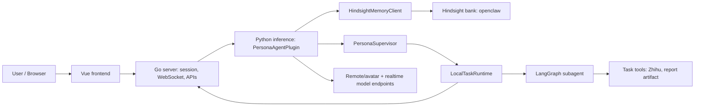
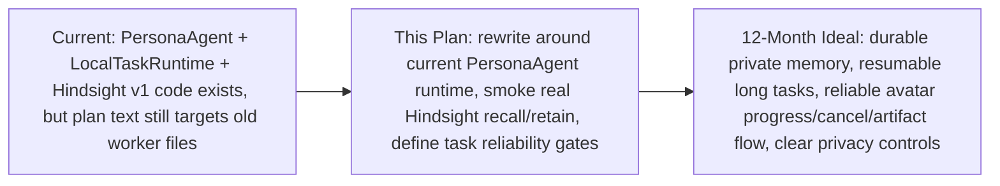

<!-- /autoplan restore point: /Users/lingyuzeng/.gstack/projects/unknown/features-autoplan-restore-20260513-085607.md -->
<!-- /autoplan restore point: /Users/lingyuzeng/.gstack/projects/dsd2077-CyberVerse/features-autoplan-restore-20260512-230547.md -->

# PersonaAgent + LocalTaskRuntime + LangGraph + Hindsight Development Plan

> **For agentic workers:** REQUIRED: Use `superpowers:subagent-driven-development` if subagents are available, or `superpowers:executing-plans` to implement this plan. Steps use checkbox (`- [ ]`) syntax for tracking.

**Decision status:** 2026-05-13 已确认改为当前架构：`PersonaAgentPlugin + LocalTaskRuntime + LangGraph subagent + Hindsight v1`。本节是新的权威计划；下方 Appendix A 保留旧计划与 `/autoplan` 审查记录，仅作为历史背景，不应继续按旧 Agent Worker / `agent_runtime/server.py` 方向实现。

**Goal:** 把 Hindsight 作为 PersonaAgent 数字人长期记忆层，并围绕当前本地 `LocalTaskRuntime` 与 LangGraph subagent 路径，补齐可验证的数字人后台任务、记忆、部署和故障恢复能力。

**Architecture:** 当前 `features` 分支的真实执行边界是 Python 进程内 PersonaAgent：`PersonaAgentPlugin` 负责实时对话与隐藏工具，`HindsightMemoryClient` 负责长期记忆，`PersonaSupervisor` 与 `LocalTaskRuntime` 负责本地任务调度，`persona/subagents` 负责 LangGraph 长任务执行；Go `server` 保持 session、WebSocket、API 转发、task event 投影和历史落盘职责。`agent_runtime/*` 当前视为兼容 shim，不作为新功能主入口。

**Tech Stack:** Python 3.10+, httpx, LangGraph, OpenAI-compatible realtime/text LLM, Go server, Vue frontend, Pixi, Hindsight API, remote GPU/avatar inference endpoints.



---

## Current Understanding

- `git pull --ff-only` 在 2026-05-13 因本地与远程各有提交而拒绝快进；已通过 `git fetch` 后 `git rebase origin/features` 接入远程最新 `origin/features`。
- 当前 `features` 本地分支在 rebase 后仍领先 `origin/features` 2 个本地提交。
- 恢复本地未提交改动时，`inference/plugins/voice_llm/persona_agent.py` 出现一次冲突；冲突解决原则是同时保留远程 task event 并发监听逻辑与本地 Hindsight source text 记忆采集逻辑。
- Hindsight v1 代码已经在工作区实现：
  - `inference/plugins/voice_llm/persona/memory.py`
  - `inference/plugins/voice_llm/persona_agent.py`
  - `tests/unit/test_hindsight_memory.py`
  - `tests/unit/test_persona_agent_plugin.py`
  - `infra/.env.example`
  - `infra/cyberverse_config.example.yaml`
  - `README.md`
  - `README.zh-CN.md`
- Hindsight v1 的设计边界保持最小：不改 Go API，不改 gRPC，不做 QMD，不把真实 key 写进仓库。
- LangGraph 后续工作应围绕 `inference/plugins/voice_llm/persona/subagents/` 的现有任务路径，而不是旧 `agent_runtime/server.py`。

## Development Assumptions

- v1 只接入 PersonaAgent 数字人路径；Standard mode 暂不加长期记忆。
- v1 使用固定 `HINDSIGHT_USER_TAG` 做跨会话隔离，不引入登录态。
- v1 每个完成回合保存简洁 `用户: ...\n助手: ...` 文本，不额外调用 LLM 做摘要或分类。
- Hindsight 服务异常不能阻塞主对话；recall 失败返回空记忆，retain 失败只记录 warning。
- 真实 Hindsight key 只放本地 `.env`，不得提交；由于 key 已在聊天上下文出现，生产/长期 key 应轮换一次。
- Go server 继续承担对外 API/WebSocket/session 职责；Python `LocalTaskRuntime` 是当前活动任务运行时，生产级持久化作为后续单独决策。
- 前端若涉及用户可见文本，必须同时维护中文和英文 i18n。

## File Map

- Keep/extend: `inference/plugins/voice_llm/persona/memory.py` - Hindsight 配置、recall、retain、错误降级和结果兼容。
- Modify if needed: `inference/plugins/voice_llm/persona_agent.py` - PersonaAgent 隐藏记忆工具、system prompt、final 后异步 retain、task event 并发输出。
- Modify if needed: `inference/plugins/voice_llm/persona/runtime.py` - 当前本地任务状态、事件、artifact、取消和 shutdown 行为。
- Modify if needed: `inference/plugins/voice_llm/persona/supervisor.py` - hidden tool 路由和任务启动 ACK 语义。
- Modify if needed: `inference/plugins/voice_llm/persona/subagents/*.py` - LangGraph 长任务、工具调用、终态 artifact 和失败路径。
- Modify if needed: `server/internal/api/tasks.go` - 仅在任务 API/auth 明确缺口时小范围修改。
- Modify if needed: `frontend/src/composables/useChat.ts`, `frontend/src/components/TaskProgressCard.vue`, `frontend/src/i18n/messages.ts` - 任务可见性与 i18n。
- Config/docs: `infra/.env.example`, `infra/cyberverse_config.example.yaml`, `README.md`, `README.zh-CN.md`.
- Tests: `tests/unit/test_hindsight_memory.py`, `tests/unit/test_persona_agent_plugin.py`, Go `server/internal/*` tests.

## Chunk 0: Post-Pull Baseline

### Task 0: Resolve pull/rebase state and verify no conflict markers

- [x] **Step 1: Fetch and integrate latest `origin/features`**

Completed on 2026-05-13 with `git rebase origin/features`. Fast-forward pull was not possible because local and remote branches had diverged.

- [x] **Step 2: Resolve PersonaAgent conflict**

Resolution keeps both:

- upstream task event queue / concurrent model-event handling;
- local `remember_source_text` callback used by Hindsight retain.

- [x] **Step 3: Verify conflict cleanup**

Run:

```bash
rg -n "<<<<<<<|=======|>>>>>>>" inference/plugins/voice_llm/persona_agent.py
git diff --check
```

Result on 2026-05-13: no conflict markers and no whitespace errors.

## Chunk 1: Hindsight v1 Closure

### Task 1: Verify PersonaAgent memory path after rebase

**Files:**
- `inference/plugins/voice_llm/persona/memory.py`
- `inference/plugins/voice_llm/persona_agent.py`
- `tests/unit/test_hindsight_memory.py`
- `tests/unit/test_persona_agent_plugin.py`

- [x] **Step 1: Keep Hindsight config optional**

Required `.env` contract:

```bash
HINDSIGHT_ENABLED=true
HINDSIGHT_BASE_URL=https://hindsight.lucky.jmsu.top
HINDSIGHT_API_KEY=your_hindsight_api_key
HINDSIGHT_BANK_ID=openclaw
HINDSIGHT_USER_TAG=openclaw
HINDSIGHT_TIMEOUT_SECONDS=30
HINDSIGHT_RECALL_MAX_RESULTS=5
HINDSIGHT_RECALL_MAX_TOKENS=4096
HINDSIGHT_RETAIN_MAX_CHARS=6000
```

Expected: missing or placeholder key disables memory without breaking conversation.

- [x] **Step 2: Keep recall as hidden tool**

PersonaAgent exposes `recall_memory` only when Hindsight is enabled. Realtime model should call it after complete user intent, before final answer.

- [x] **Step 3: Keep retain nonblocking**

After assistant final response, PersonaAgent schedules retain in the background and drains/cancels tasks during shutdown.

- [x] **Step 4: Re-run focused unit tests after pull**

Run:

```bash
pixi run -e macos-arm python -m pytest tests/unit/test_hindsight_memory.py tests/unit/test_persona_agent_plugin.py -q
```

Result on 2026-05-13: PASS with `16 passed, 1 warning`.

- [ ] **Step 5: Manual Hindsight smoke**

With local `.env` configured and without committing secrets:

1. Say: `记住我喜欢用 Pixi 管理环境。`
2. Wait for final response.
3. In a new session ask: `我之前说过我喜欢怎么管理环境吗？`

Expected: PersonaAgent recalls the Pixi preference naturally. If Hindsight is unavailable, normal conversation continues without memory.

Status on 2026-05-13: Hindsight live recall smoke passed after adding local `.env`; client enabled and returned 5 recall results. Full digital-human conversation smoke still needs DashScope/Qwen and remote avatar/inference configuration.

## Chunk 2: PersonaAgent + LocalTaskRuntime Reliability

### Task 2: Make the active digital-human task path measurable

**Files:**
- `inference/plugins/voice_llm/persona_agent.py`
- `inference/plugins/voice_llm/persona/runtime.py`
- `inference/plugins/voice_llm/persona/supervisor.py`
- `inference/plugins/voice_llm/persona/subagents/`
- `tests/unit/test_persona_agent_plugin.py`

- [x] **Step 1: Preserve nonblocking ACK behavior**

Acceptance:

- `create_task` returns accepted tool result before task completion;
- assistant final ACK happens before background task start when applicable;
- task event queue can emit progress while model stream is still open.

Result on 2026-05-13: `LocalTaskRuntime.create_task()` now only creates a queued task. PersonaAgent schedules `start_task()` after assistant ACK final, and tests assert ACK appears before `task.started`.

- [x] **Step 2: Define terminal task behavior**

Acceptance:

- completed task emits `task.completed` and artifact payload if created;
- failed task emits `task.failed` with actionable reason;
- cancelled task emits `task.cancelled`;
- if model never calls terminal artifact tool, bounded iteration/timeout marks failure instead of hanging.

Result on 2026-05-13: tests cover completed artifact flow, explicit failure, cancellation, and missing terminal report -> `task.failed`.

- [x] **Step 3: Verify cancellation**

Acceptance:

- user cancellation targets latest active session task;
- background work stops or becomes terminal quickly;
- digital human acknowledges cancellation in normal language.

Result on 2026-05-13: `test_local_task_runtime_cancels_active_task` verifies latest active task cancellation emits `task.cancelled`.

- [x] **Step 4: Add focused tests only where gaps are found**

Do not refactor runtime structure unless a test exposes an actual failure.

Result on 2026-05-13: added focused tests in `tests/unit/test_persona_agent_plugin.py`; no broad runtime refactor.

## Chunk 3: LangGraph Subagent Trust Path

### Task 3: Prove one useful task before abstracting providers

**Files:**
- `inference/plugins/voice_llm/persona/subagents/agent.py`
- `inference/plugins/voice_llm/persona/subagents/default_tools.py`
- related tests under `tests/unit/`

- [x] **Step 1: Keep current tool path first**

Use the existing `ZhihuToolExecutor` + `create_html_report` path for the first end-to-end task. Do not prioritize generic `SearchTool` factory until this path is trustworthy.

Result on 2026-05-13: kept the existing Zhihu/default tool path and added tests around `create_html_report`.

- [x] **Step 2: Add no-source and weak-source behavior**

Acceptance:

- no results produce a visible no-source explanation or small artifact;
- weak/conflicting results are not presented as strong facts;
- tool credential failures produce clear failed task events.

Result on 2026-05-13: subagent prompt now requires a terminal report even on empty/tool-error results, with caveats instead of pretending weak evidence is fact. Tests verify no-source HTML artifact and clear missing `ZHIHU_ACCESS_SECRET` error.

- [x] **Step 3: Artifact handoff**

Acceptance:

- generated HTML/markdown artifact has stable title, MIME type, and URL;
- frontend can open it from task event payload;
- digital human final message can reference completion without dumping the full artifact.

Result on 2026-05-13: tests verify HTML artifact type, MIME type, source count, tool trace metadata, and `task.completed` payload with `artifact_id`.

## Chunk 4: Frontend Task Visibility And i18n

### Task 4: Make task state understandable in Chinese and English

**Files:**
- `frontend/src/composables/useChat.ts`
- `frontend/src/components/TaskProgressCard.vue`
- `frontend/src/i18n/messages.ts`

- [x] **Step 1: Audit hardcoded visible strings**

Current task UI contains Chinese literals. If this plan touches task UI, move visible strings behind existing i18n.

Result on 2026-05-13: task status, event titles, current step, timeline labels, artifact labels, and artifact actions now use the `task` i18n namespace in Chinese and English.

- [x] **Step 2: Verify task card states**

Acceptance:

- queued/running/completed/failed/cancelled states are visible;
- artifact link is visible and stable;
- long task titles and messages do not overflow on mobile or desktop.

Result on 2026-05-13: task card still exposes queued/running/completed/failed/cancelled states and artifact links; existing CSS keeps task titles and artifact titles constrained with ellipsis.

- [x] **Step 3: Build only if frontend changes**

Run:

```bash
npm run --prefix frontend build
```

Result on 2026-05-13: PASS.

## Chunk 5: Deployment, `.env`, And Remote GPU/Avatar Smoke

### Task 5: Keep Mac development lightweight and remote inference explicit

**Files:**
- `infra/.env.example`
- `infra/cyberverse_config.example.yaml`
- `README.md`
- `README.zh-CN.md`
- optional deployment docs

- [x] **Step 1: Document required interfaces**

The local Mac needs:

- OpenAI-compatible LLM URL/key/model for PersonaAgent;
- Hindsight URL/key/bank/tag for memory;
- remote avatar/inference API URL(s) if the digital-human model runs on Ubuntu GPU;
- Go server/frontend local URLs;
- optional search/Zhihu credentials for task tools.

Result on 2026-05-13: root README, Chinese README, `infra/.env.example`, `infra/cyberverse_config.example.yaml`, and `deploy/gpu/*` document PersonaAgent LLM, Hindsight, Zhihu, local API, and remote GPU/avatar endpoints.

- [x] **Step 2: Keep secrets local**

Expected:

- `.env` is ignored by git;
- docs use placeholders only;
- exposed Hindsight development key is not copied into docs or source.

Result on 2026-05-13: secret scan found no copied real Hindsight key fragments; docs and examples use placeholders only.

- [x] **Step 3: One-command local startup**

Use or maintain the Pixi dev command that starts local services in the foreground and terminates child processes on `Ctrl+C`.

Expected:

```bash
pixi run -e macos-arm dev
```

starts the local Mac-side CyberVerse services that call remote GPU/avatar endpoints through `.env`.

Result on 2026-05-13: `pixi run -e macos-arm dev` is documented in README/README.zh-CN and maintained in `pixi.toml`; full service smoke still depends on local `.env` and remote GPU/avatar availability.

## Chunk 6: Final Verification

Run after implementation or conflict resolution:

```bash
pixi run -e macos-arm python-agent-test
pixi run -e macos-arm go-test
git diff --check
```

Run frontend build only if frontend files were changed:

```bash
npm run --prefix frontend build
```

Expected: all relevant commands pass. If an external service is unavailable, document the exact missing dependency and whether the failure blocks local development.

Result on 2026-05-13:

- `pixi run -e macos-arm python-agent-test`: PASS, `23 passed, 1 warning`.
- `pixi run -e macos-arm go-test`: PASS.
- `npm run --prefix frontend build`: PASS.
- `git diff --check`: PASS.
- YAML parse check for `infra/cyberverse_config.example.yaml` and `deploy/gpu/cyberverse_config.gpu.yaml`: PASS.
- Real Hindsight recall smoke: PASS after local `.env` was added.
- Full digital-human conversation smoke: blocked by missing DashScope/Qwen and remote avatar/inference configuration; does not block unit/local regression coverage.

## Future Decisions

- Whether active task state should remain Python in-memory or move to Go as a durable source of truth.
- Whether QMD/local markdown memory adds value after Hindsight v1 is stable.
- Whether generic search provider abstraction is worth adding after the current Zhihu/report path is proven.
- Whether production deployment should split PersonaAgent, task runtime, and avatar inference into separate services.

---

## Appendix A: Superseded Legacy Plan (Do Not Implement)

The previous 2026-05-11 plan targeted the old Agent Worker and `agent_runtime/server.py` architecture. It has been intentionally replaced by the current PersonaAgent + LocalTaskRuntime + LangGraph subagent + Hindsight v1 plan above. Restore details are available from the two `/autoplan restore point` comments at the top of this file.

## GSTACK Autoplan Review Report

### Phase 1: CEO Premise Review

**Scope detected**

- UI scope: yes. Task progress and artifact visibility touch `frontend/src/composables/useChat.ts`, `frontend/src/components/TaskProgressCard.vue`, and i18n copy.
- DX scope: yes. The plan depends on API wiring, Pixi startup, `.env` configuration, and repeatable local/remote runtime setup.
- Review voices: Claude subagent completed; Codex CLI review timed out after partial code inspection, but its partial finding matched the main blocker below.

**Primary blocker**

This plan is stale against the current branch. It describes an older Agent Worker HTTP boundary and `agent_runtime/server.py`, but the current code has moved the agent runtime in-process:

- `agent_runtime/graph.py` is now a compatibility re-export shim.
- `agent_runtime/tools.py` is now a compatibility re-export shim.
- `agent_runtime/server.py` does not exist.
- `inference/plugins/voice_llm/persona/runtime.py` owns `LocalTaskRuntime`.
- `inference/plugins/voice_llm/persona/supervisor.py` owns PersonaAgent supervisor routing.
- `inference/plugins/voice_llm/persona/subagents/agent.py` owns the LangGraph subagent path.
- `inference/plugins/voice_llm/persona/subagents/default_tools.py` owns the default task tools, including `create_html_report`.

The plan should not add work to the old Worker boundary unless the product decision is to reintroduce that boundary intentionally.

**Product premise challenge**

The strongest product objective is not "build a generic LangGraph research agent." It is:

```text
The digital human can acknowledge a user request immediately, continue speaking naturally,
run a bounded long task through LangGraph, surface progress and artifacts, and recover from
missing tools, missing credentials, cancellation, and remote runtime failures.
```

The avatar only matters if the user sees embodied task progress: quick acknowledgment, interruptible work, visible state, and a finished artifact that the digital human can reference.

**Existing leverage map**

| Area | Current code to preserve | Review note |
| --- | --- | --- |
| Persona turn handling | `PersonaAgentPlugin` | Keep voice/chat response fast; do not block avatar turns on long tasks. |
| Task runtime | `LocalTaskRuntime` | This is the current execution boundary; inject memory and Hindsight here first if needed. |
| Supervisor | `PersonaSupervisor` | Keep structured tool calls as the control path. |
| Subagent | `run_subagent`, `run_task_with_langgraph` | Add acceptance limits around iterations, terminal artifact creation, and failure paths. |
| Tools | `ZhihuToolExecutor`, `create_html_report` | Prove the existing Zhihu/report path before building a generic search provider factory. |
| Go task API | `server/internal/agenttask`, `server/internal/api/tasks.go` | Keep one task surface for frontend state. |
| Frontend | `useChat`, `TaskProgressCard.vue` | Needs i18n and remote API image URL handling if changed. |
| Environment | Pixi, `.env`, docs | Runtime keys and remote GPU endpoints must be documented as required startup inputs. |

**Dream-state ladder**

```text
CURRENT
  Digital human can run locally wired PersonaAgent code, and remote GPU services can be reached.
  Task execution exists, but the plan references older architecture and acceptance criteria are loose.

THIS PLAN, FIXED
  Plan targets current in-process PersonaAgent runtime.
  One research task can be started, tracked, cancelled, completed, and displayed with an artifact.
  Missing secrets, missing search results, and remote failures have explicit user-visible fallbacks.

12-MONTH IDEAL
  Digital human has durable user memory through Hindsight or a local memory layer.
  Long tasks are resumable, auditable, and privacy-aware.
  The avatar becomes the interaction surface for progress, interruption, and task handoff.
```

### Alternatives

| Option | Decision | Reason |
| --- | --- | --- |
| Patch the old Agent Worker plan | Reject | It targets missing files and conflicts with current code. |
| Reframe around current PersonaAgent local runtime | Recommended | Lowest-risk path and matches the branch. |
| Reintroduce external Agent Worker now | Defer | Larger scope; only worth doing if deployment isolation becomes a hard requirement. |
| Build a generic search provider factory first | Defer | Current tool path already uses `ZhihuToolExecutor`; prove one real path before generalizing. |
| Add QMD local memory now | Defer | User marked QMD optional; Hindsight boundary should be specified first. |

### Selective Expansion

The plan should expand only in the areas that protect the user-visible digital-human workflow:

- Update architecture sections to current PersonaAgent/LocalTaskRuntime code.
- Add explicit `.env` contract for LLM, Hindsight, Zhihu/search, remote inference, and avatar endpoints.
- Add acceptance criteria for acknowledgment latency, task event emission, artifact creation, cancellation, and no-source fallback.
- Add i18n requirements for every frontend string touched by task progress UI.
- Add a later memory-injection chunk that stores/retrieves through Hindsight at the PersonaAgent runtime boundary.

Do not expand into a second orchestrator, a provider marketplace, or a local QMD memory system in this pass.

### Temporal Interrogation

| Horizon | What must be true |
| --- | --- |
| Hour 1 | Plan no longer references `agent_runtime/server.py`; all chunks point to current runtime files. |
| Hour 6 | One real PersonaAgent task can produce progress events and an artifact against configured services. |
| Day 2 | Frontend build passes with i18n task strings and clear failure/cancellation states. |
| Week 2 | Hindsight integration point is implemented or specified with privacy and deletion behavior. |
| Month 6 | Memory improves continuity without leaking private history into unrelated sessions. |

### Dual-Voice Review

| Voice | Result |
| --- | --- |
| Claude subagent | Strong objection: plan solves yesterday's architecture; recommended reframing around in-process PersonaAgent runtime. |
| Codex CLI | Timed out before final response; partial inspection independently found the same Agent Worker mismatch. |
| Consensus | The premise must change before detailed engineering review continues. |

### Findings

| Area | Risk | Finding |
| --- | --- | --- |
| Architecture | Critical | Plan targets old Agent Worker files and graph stages that are not present in the current branch. |
| Error rescue | High | Missing explicit fallbacks for missing keys, no search results, no terminal report tool call, and remote service failure. |
| Product | High | Generic research-agent framing underuses the digital human; progress, interruption, and artifact handoff are the defensible workflow. |
| Tests | High | Current plan needs tests for cancellation, failed task events, missing credentials, no terminal artifact, and frontend i18n build behavior. |
| Security | Medium | Hindsight keys, LLM keys, search credentials, and persisted memory need privacy boundaries before implementation. |
| Data flow | Medium | Artifact and character image URLs may need normalization when the Mac frontend talks to a remote API. |
| Observability | Medium | Need correlation IDs or task IDs in logs across PersonaAgent, task runtime, Go API, and frontend events. |
| Performance | Medium | `max_agent_iterations` exists, but plan should also define wall-clock bounds and first-ack latency. |
| UX | Medium | `TaskProgressCard.vue` currently contains Chinese literals; any touched visible text needs Chinese and English entries. |
| Deployment | Medium | Remote GPU service is separate from local Mac Pixi startup; `.env` must distinguish local UI/API from remote inference/avatar endpoints. |

### Error And Rescue Registry

| Failure | Required behavior |
| --- | --- |
| Missing LLM URL/key/model | Refuse task start with a visible configuration error; do not hang the avatar turn. |
| Missing Hindsight URL/key | Continue without durable memory if memory is optional; log degraded mode. |
| Missing Zhihu/search credentials | Return a no-tool fallback response and a failed task event with actionable reason. |
| No search results | Complete with a short no-source artifact or user-visible explanation. |
| Model never calls terminal artifact tool | Stop after bounded iterations and mark task failed with a clear reason. |
| User cancels active task | Emit `task.cancelled`, stop background work, and let the digital human acknowledge cancellation. |
| Remote GPU/avatar endpoint unavailable | Keep frontend/API alive and show connection failure without crashing task UI. |

### Failure Modes To Test

| Test target | Case |
| --- | --- |
| PersonaAgent runtime | Task start returns quickly while background task continues. |
| LangGraph subagent | Fake model calls tools then `create_html_report`. |
| LangGraph subagent | Fake model exceeds iteration cap without terminal report. |
| Task runtime | Exception emits `task.failed`. |
| Task runtime | Cancellation emits `task.cancelled`. |
| Frontend | Task progress and artifact UI build in Chinese and English. |
| Remote Mac-to-Ubuntu flow | Mac frontend/API can reach remote inference and avatar URLs from `.env`. |

### Not In Scope For This Plan

- Reintroducing a separate Agent Worker HTTP service.
- Adding a second task orchestrator beside the current Go task API and `LocalTaskRuntime`.
- Building a generic search provider marketplace.
- Implementing QMD local memory in this pass.
- Replacing PersonaAgent tool-call routing with visible JSON parsing.
- Expanding Standard mode task behavior unless required by the current PersonaAgent path.

### Decision Audit Trail

| Decision | Status | Reason |
| --- | --- | --- |
| Use Selective Expansion | Proposed | Existing core runtime exists, but the plan must be corrected. |
| Reframe to current in-process PersonaAgent runtime | Proposed | Matches current code and avoids resurrecting missing Worker files. |
| Prove existing Zhihu/report tool path first | Proposed | It is already wired; generic search abstraction can wait. |
| Require i18n before touching task UI | Proposed | Project guidelines require Chinese and English user-facing text. |
| Defer QMD memory | Proposed | Hindsight integration is the minimal durable-memory path requested by the user. |

### Premise Gate

Before Phase 2 engineering review continues, confirm the core premise:

> Should this plan be rewritten around the current `PersonaAgentPlugin` + `LocalTaskRuntime` + LangGraph subagent architecture, instead of the old Agent Worker / `agent_runtime/server.py` architecture?

## GSTACK Autoplan Review Report - 2026-05-13 Hindsight Implementation Pass

### Scope

- Review mode: Phase 1 CEO / founder premise review.
- UI scope detected: yes. The task card and chat stream are part of the visible product path.
- DX scope detected: yes. Pixi, `.env`, backend services, remote GPU/avatar URLs, and Hindsight configuration affect first-run reliability.
- Current implementation status: Hindsight v1 memory code has been added to the PersonaAgent path and unit/regression tests passed locally before this review.

### 0A. Premises Under Review

| Premise | Verdict | Reason |
| --- | --- | --- |
| `agent_runtime/graph.py` owns the research graph | False | Current `agent_runtime/graph.py` is a compatibility re-export shim. The active runtime is under `inference/plugins/voice_llm/persona/`. |
| `agent_runtime/server.py` is the worker/API boundary | False | That file does not exist in this branch. Continuing to target it would recreate an old boundary. |
| Search provider factory is the next highest-leverage work | Weak | The active path uses `ZhihuToolExecutor` and `create_html_report`; generic provider selection is not the current blocker. |
| Go TaskService owns active task state | Unresolved | The visible Go API exists, but `LocalTaskRuntime` currently stores task state/events/artifacts in memory. |
| Hindsight memory should be PersonaAgent-only in v1 | Strong | This matches the implemented digital-human path and avoids changing Go/gRPC protocol for the first durable-memory pass. |

### 0B. Existing Code Leverage Map

| Area | Current asset | How to leverage |
| --- | --- | --- |
| Digital-human brain | `inference/plugins/voice_llm/persona_agent.py` | Keep memory/tool orchestration in the active PersonaAgent path. |
| Long-term memory | `inference/plugins/voice_llm/persona/memory.py` | Use Hindsight recall before response and nonblocking retain after final response. |
| Task orchestration | `inference/plugins/voice_llm/persona/runtime.py` and `supervisor.py` | Treat `LocalTaskRuntime` as the current source of active task execution until persistence is deliberately redesigned. |
| LangGraph task work | `inference/plugins/voice_llm/persona/subagents/` | Prove the existing Zhihu-to-HTML-report workflow before abstracting providers. |
| Go/API layer | `server/internal/api/tasks.go` | Keep it as session/WebSocket/task projection layer unless a durability project is opened. |
| Frontend task UI | `frontend/src/components/TaskProgressCard.vue`, `frontend/src/composables/useChat.ts` | Make progress, cancellation, failure, and artifacts bilingual before shipping task UI changes. |

### 0C. Dream State Delta



### 0C-bis. Alternatives

| Option | Decision | Why |
| --- | --- | --- |
| Rewrite around current PersonaAgent runtime | Recommended | Matches the branch and the implemented Hindsight work. |
| Preserve old Agent Worker architecture | Reject | It points at missing/obsolete files and adds avoidable architecture. |
| Move task source of truth into Go now | Defer | Important for production durability, but larger than Hindsight v1. |
| Build generic search provider factory now | Defer | The immediate product risk is task trust/reliability, not provider variety. |

### 0D. Mode Selection

Mode: Selective Expansion.

Approved expansion:
- Correct the plan to current PersonaAgent runtime files.
- Keep Hindsight memory v1 in PersonaAgent only.
- Add real-service Hindsight smoke verification.
- Add explicit failure/cancel/no-source acceptance criteria.
- Treat task UI i18n and internal API auth posture as ship gates.

Deferred:
- Separate Agent Worker service.
- QMD local memory.
- Generic search provider marketplace.
- Full Go-owned durable task persistence.

### 0E. Temporal Interrogation

| Horizon | What must be true |
| --- | --- |
| Hour 1 | The plan no longer targets `agent_runtime/server.py`; all chunks name the current PersonaAgent files. |
| Hour 6 | Hindsight recall/retain can be smoke-tested against configured `.env` without committing secrets. |
| Day 2 | One end-to-end digital-human task can show progress, cancellation/failure, and artifact handoff. |
| Week 2 | Memory privacy behavior, user tag isolation, and deletion/rotation guidance are documented. |
| Month 6 | Users trust the avatar because it remembers relevant context without leaking unrelated private history. |

### 0F. Premise Gate

Phase 2 should not continue until the user confirms the plan should be rewritten around `PersonaAgentPlugin + LocalTaskRuntime + LangGraph subagent`, with Hindsight memory v1 as the current shipped path.

### Dual-Voice Review

| Voice | Result |
| --- | --- |
| Claude subagent | Critical objection: the plan solves yesterday's architecture and should reframe around the in-process PersonaAgent runtime. |
| Codex CLI | Premise gate failed: `agent_runtime/graph.py` and `tools.py` are shims, `agent_runtime/server.py` is absent, and the active runtime is `persona/runtime.py`. |
| Consensus | Do not implement the old plan as written. Rewrite the plan around the current branch and prove one real digital-human task/memory flow. |

### Consensus Dimensions

| Dimension | Result |
| --- | --- |
| Architecture | Current plan is stale; active orchestration is in-process PersonaAgent, not old Worker files. |
| Product | The differentiated product is embodied long-running work with memory, progress, interruption, and artifact handoff. |
| Scope | Hindsight v1 and task reliability are appropriate; search-provider abstraction is premature. |
| Risk | Persistence, auth, privacy, and weak/no-source task outcomes need explicit treatment. |
| UX | Task UI must be bilingual and measurable on first ACK, progress, cancel, failure, and artifact visibility. |
| DX | `.env` examples and Pixi commands are useful, but live smoke commands and remote endpoint assumptions need to be explicit. |

### Required Review Sections

1. Architecture: rewrite around `PersonaAgentPlugin`, `HindsightMemoryClient`, `LocalTaskRuntime`, `PersonaSupervisor`, and `run_task_with_langgraph`. Treat `agent_runtime/*` as compatibility surface unless proven otherwise.
2. Error/rescue: Hindsight failure is correctly designed as nonblocking, but task flow still needs acceptance behavior for missing credentials, no sources, model never producing an artifact, cancellation, and remote avatar/GPU outage.
3. Product: a generic research agent is not enough. The product promise is a digital human that remembers, acknowledges quickly, works in the background, and returns a trustworthy artifact.
4. Scope: keep v1 narrow: PersonaAgent memory plus one reliable task path. Defer QMD, new Go protocol, and provider marketplace.
5. Alternatives: do not add a SearchTool factory before proving the current Zhihu/report tool path and source-quality behavior.
6. Security/privacy: never commit Hindsight keys; rotate the exposed development key; document user tag isolation, retention, and production `AGENT_INTERNAL_TOKEN` expectations.
7. Data flow: user turn -> Hindsight recall -> realtime model/tool loop -> final assistant text -> async retain; task events/artifacts flow from Python runtime to Go/WebSocket/frontend.
8. Observability: add task IDs and memory operation warnings to logs; later add metrics for recall latency, retain failure, task terminal status, and artifact creation.
9. Performance: recall adds latency before response. Keep timeout/budget bounded and only force recall on complete user intent, not partial speech.
10. Deployment/DX: `.env` should distinguish local Mac services, remote GPU/avatar services, LLM endpoint, and Hindsight endpoint. Provide a smoke path that does not expose keys.
11. Design/UI: hardcoded task UI text must move behind existing i18n before task UI changes are considered complete.

### Error And Rescue Registry

| Failure | Required behavior |
| --- | --- |
| Hindsight URL/key missing | Disable memory and continue normal PersonaAgent conversation. |
| Hindsight recall timeout/error | Log warning, return empty memory, continue response. |
| Hindsight retain timeout/error | Log warning, do not block final response or leak background tasks. |
| Missing LLM/remote avatar config | Surface a clear configuration failure instead of hanging the avatar turn. |
| Search credentials missing | Emit failed task state with actionable reason. |
| No useful sources | Complete with transparent no-source explanation or artifact. |
| Terminal artifact tool never called | Stop after bounded iterations and mark the task failed. |
| User cancels | Emit `task.cancelled`, stop background work, and let the digital human acknowledge. |
| Internal task API unauthenticated in production | Require a nonempty token or document dev-only exposure. |

### Failure Modes To Test

| Target | Case |
| --- | --- |
| Hindsight client | recall payload includes query, world/experience types, mid budget, max tokens, tag, and `tags_match=any`. |
| Hindsight client | retain payload includes one `{content, context, tags}` item and `async=true`. |
| PersonaAgent | memory enabled exposes hidden `recall_memory`; disabled mode does not. |
| PersonaAgent | fake realtime model calls recall and receives memory tool result. |
| PersonaAgent | assistant final schedules retain and shutdown drains/cancels background tasks. |
| Task runtime | start returns quickly while background work continues. |
| Task runtime | failure and cancellation produce terminal events. |
| Frontend | task progress/artifact/failure labels are bilingual. |
| Remote deployment | Mac startup can reach remote inference/avatar endpoints from `.env`. |

### Not In Scope

- Recreating `agent_runtime/server.py`.
- Changing Go API or gRPC protocol for Hindsight v1.
- Building QMD local memory.
- Adding login/user identity beyond fixed `HINDSIGHT_USER_TAG`.
- Making generic search-provider abstraction the first follow-up.
- Promising durable task recovery across process restart before a source-of-truth decision.

### What Already Exists

- PersonaAgent-side Hindsight config/client and hidden recall tool.
- Async retain after assistant final response.
- `.env` and config example entries for Hindsight.
- Unit tests for Hindsight payloads/error tolerance and PersonaAgent memory wiring.
- Regression tests passed locally: Python agent tests, Go tests, and targeted unit tests.

### Decision Audit Trail

| Decision | Classification | Principle | Status |
| --- | --- | --- | --- |
| Selective Expansion | Mechanical | P1/P2: preserve current working runtime and expand only where needed | Proposed |
| Reframe to current PersonaAgent runtime | User Challenge | Old plan targets missing files and would waste engineering effort | Requires user confirmation |
| Keep Hindsight v1 PersonaAgent-only | Mechanical | P3/P5: minimum-change integration with no protocol churn | Proposed |
| Defer SearchTool factory | Mechanical | P4/P5: prove current product path before abstraction | Proposed |
| Defer Go-owned durable task state | Taste/Strategy | Production durability matters, but it is a larger separate design | Proposed |
| Require i18n/security smoke gates | Mechanical | P1: visible product and production safety should not regress | Proposed |

### Phase 1 Completion Summary

Phase 1 found a blocking premise mismatch. Both review voices agree that the plan should be rewritten before Phase 2 engineering review continues. The correct next decision is whether to make the current `PersonaAgentPlugin + LocalTaskRuntime + LangGraph subagent + Hindsight v1` path the official plan baseline.
